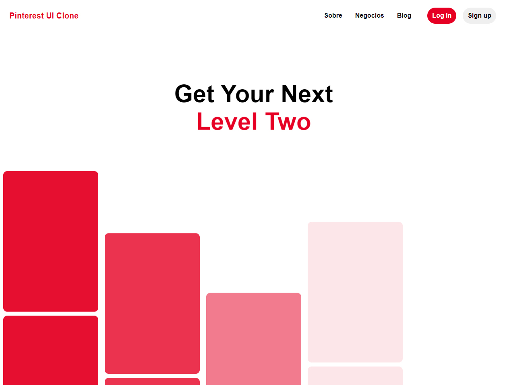

<h1 text-align: 'center'> Clone UI Pinterest (HomePage)</h1>

Projeto feito com intuito de estudar e praticar SASS e Front - End

## Resources

- [x] HTML, CSS(SASS), JS

## Start Dev Environment for VSCode

1. Open project folder in `VSCode`
2. Install `Live Server` extension
3. Right click `index.html` > `Open with Live Server`
4. Access the **generated address** in your browser 🚀

